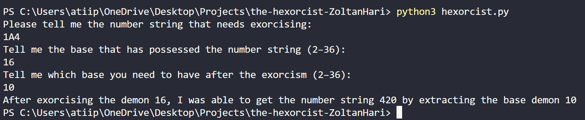

[](https://classroom.github.com/a/1Lpan6Kl)
[](https://classroom.github.com/open-in-codespaces?assignment_repo_id=21200553)
# The Hexorcist
The Hexorcist is base converter from binary or hexadecimal that is able convert number string from Base-2 to Base-32 into any other base from Base-2 to Base-32. The Hexorcist's goal is to get you target base by performing a exorcism to extract the end number string from the one you put in.


## Requirements

- Python 3 or higher
- Git
- Pytest

## Installation

1. Clone the Repository
```bash
git clone https://github.com/WTCSC/the-hexorcist-ZoltanHari.git
```
2. Open the Cloned Repository
```bash
cd the-hexorcist-ZoltanHari
```
## Usage

1. Start the program with the command **`python3 hexorcist.py`** in the terminal

2. Type in the binary or hexadecimal you want to convert

3. Type in the base you are converting from

4. Type in the base you want to convert to

## Usage Example



## Testing

To run the tests for the calculator, you need to enter **`pytest path/to/hexorcist/the-hexorcist-ZoltanHari`** in the terminal, wait for the tests to finish, and see the result

## Testing Example


## Decision Tree 
